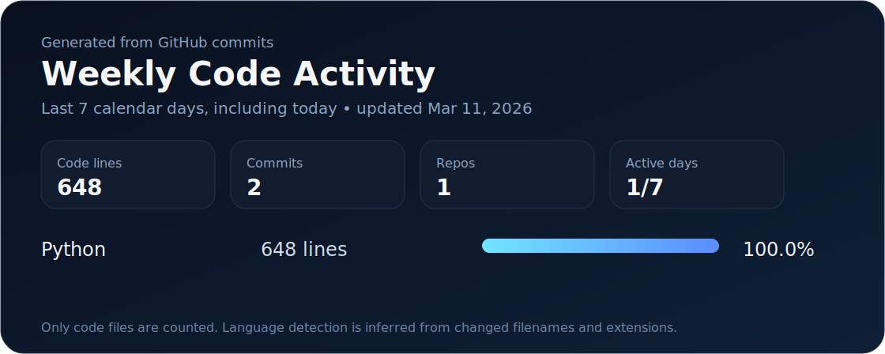

<div align="center">

# hey, i'm kyan

Code, experiments, and a weekly snapshot of shipped work generated straight from GitHub.

</div>

<!-- profile-stats:start -->
## Activity Dashboard

<p align="center">
  
</p>

> Rolling window: the last 7 calendar days, including today.

<details>
<summary>Open raw weekly breakdown</summary>

<sub>Updated 2026-03-11 03:10 UTC</sub>

- Added: +600
- Deleted: -48
- Net delta: +552
- Code-touching commits: 2
- Repositories touched: 1
- Active days: 1 / 7
- Average code lines per commit: 324
- Average code lines per active day: 648

### Daily Throughput

```text
03-05 | .                        0 code lines | 0 commits
03-06 | .                        0 code lines | 0 commits
03-07 | .                        0 code lines | 0 commits
03-08 | .                        0 code lines | 0 commits
03-09 | .                        0 code lines | 0 commits
03-10 | .                        0 code lines | 0 commits
03-11 | ##################     648 code lines | 2 commits
```

### Highlights

- Busiest day: `2026-03-11` with 648 code lines changed across 2 commits
- Largest commit: `kyan-yang/kyan-yang@3dae7b8` with +378 / -0

### Top Repositories

| Repository | Code lines | Added | Deleted | Commits |
| --- | ---: | ---: | ---: | ---: |
| `kyan-yang/kyan-yang` | 648 | +600 | -48 | 2 |

> Language detection is inferred from changed filenames and extensions.

> Coverage is limited to code-file changes in public activity. Add PROFILE_STATS_TOKEN to include private and collaborator repositories.

</details>
<!-- profile-stats:end -->

<details>
<summary>How this profile works</summary>

- A GitHub Actions workflow refreshes this dashboard every day.
- The updater script counts code-only additions, deletions, commits, active days, languages, and the repositories touched most recently.
- Private repositories are included when the workflow can read them through `PROFILE_STATS_TOKEN`.

</details>
